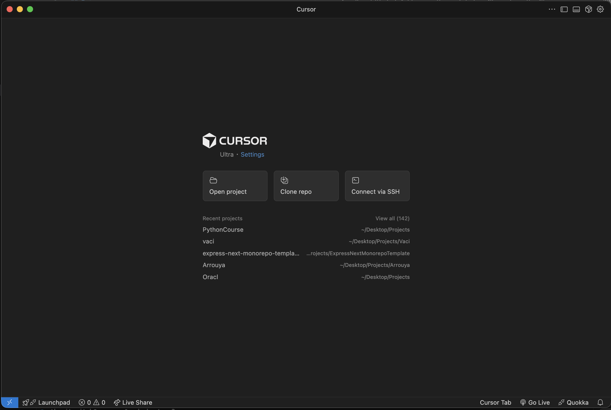
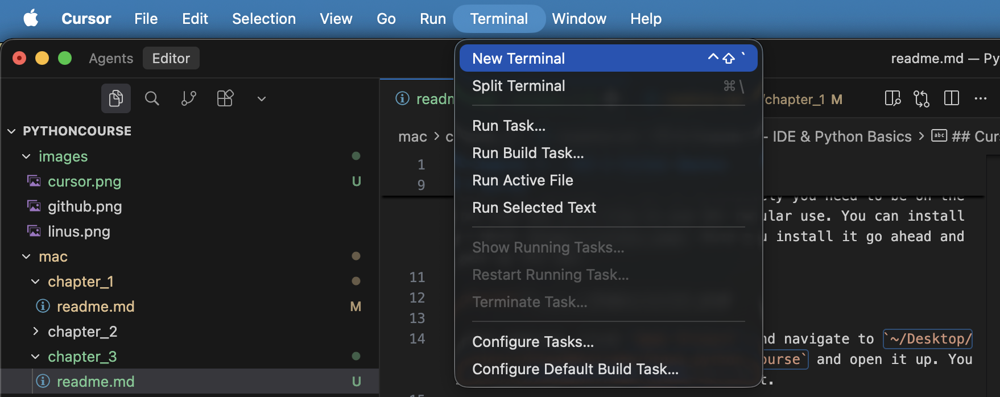
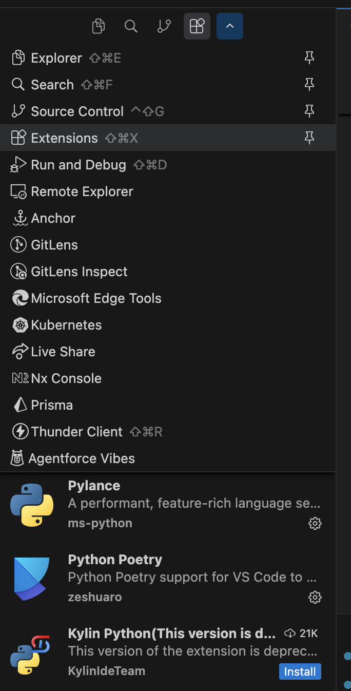
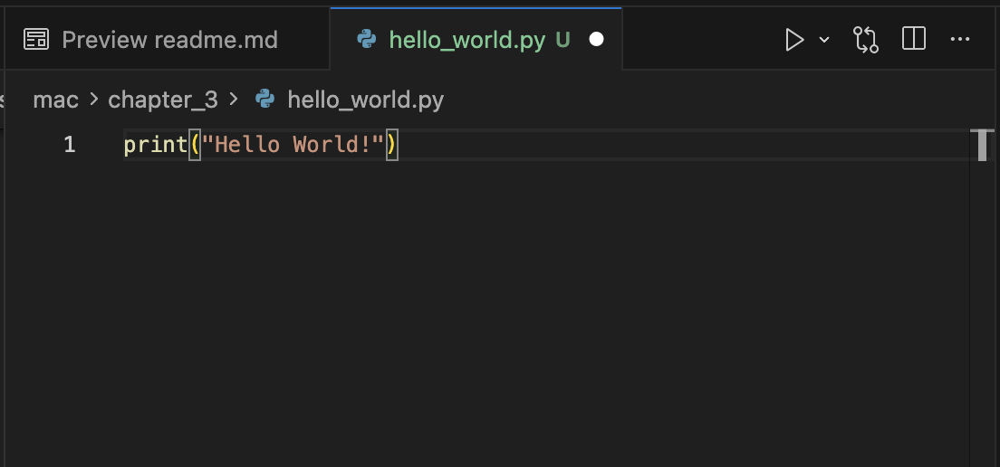

# Chapter 3 - IDE & Python Basics

## Objective
By the end of this chapter you will know how to open your code in a development environment, install apps to make your life easy and write basic python scripts

## Intro
So far, we've setup git, installed python and ran some basic python commands. Running python in the shell is great for basic commands but as we start writing bigger scripts (really anything more than a few lines) it's helpful to save the scripts to a file and run the file instead of the commands individually. As projects grow we even need to break up our scripts into multiple files over multiple folders. Organizing and visualizing these files can get messy so it's helpful to use an interactive development environment or IDE for short which solves these problems for us. Not only do these help with code organization but they also come with marketplaces for bringing in addons to help with writing code. Modern IDEs even come with built-in AI chats so you can highlight a section of your code and ask your favorite llm about it (game changer!). So let's get started setting up our first IDE

## Cursor
As of writing this, my favorite IDE is Cursor. Up until recently I used an IDE called Visual Studio Code. However, VS Code was open source and Cursor built on top of it and added modern AI tooling. To use AI extensively you need to be on the Pro tier but it's free to use for regular use. You can install it here: https://cursor.com/. Once you install it, go ahead and open up the app. 

After opening, click `Open Project` and navigate to `C:\Users\YourUsername\Desktop\Projects\HtgaaBootcamp\htgaa_python_course` (replace `YourUsername` with your actual Windows username) and open it up. You should see all the folders on the left.

Before we go ahead and write some python code I wanted to go over a few cool features IDEs have. First, IDEs come with a built-in terminals! At the top nav you should see a `Terminal` option, click `Terminal` then `New Terminal`.

If you cd into chapter 3 you can run the `run_me.py` file with `python run_me.py`. Great we're now running python code from within our IDE!

Next, let's install some extensions. The two I like to use for python are `Python` & `Pylance`. These will help make the python code a little more readable and add some handy features on top like bug detection and help with jumping around the codebase. Search those up in the extensions side bar and hit install.

Alright, we're finally all set to write some python code. First, create a file called `hello_world.py` in `(your-operating-system)/chapter_3`. You can do this from the nav bar on the left or from the terminal if you're feeling up to it (in PowerShell you can use `New-Item hello_world.py` or in Command Prompt you can use `type nul > hello_world.py` to create the file)

Open up the file by double clicking on it. We will start small by writing the simplest python program `print("Hello World!")` running this line will print `Hello World` to the console. 

Now, you probably noticed the white dot next to the file name. This means the file ISN'T saved. Which means, as far as the terminal is concerned, there is no code there. If you run `python hello_world.py` nothing will happen. I cannot tell you how often I've written code and didn't get the expected behavior only to realize that I forgot to save the file. To save the file use the shortcut `Ctrl + S`. At the start I'm sure you will forget a few times but trust me, eventually you build muscle memory. Well anyways, save the file and run `python hello_world.py`. Congrats, you've now written your first python file. 

Now as far as things go this is a pretty lame "hello world" but good thing we have AI to help us with that. If you go back to your hello world script, select the print statement and right click. You will see an option for "Add Symbol to New Chat" this will open up an AI chat window and give it the context. You can then prompt it to "make the hello world more interesting". See what you get!

Note: If you don't have the credits on Cursor, go to any llm client and ask it for a cool hello world script in python. Copy and paste the output into your `hello_world.py` file and run it.

Now that we have our developer environment setup, let's quickly go through some python basics. Open up the `basics.py` file in the `chapter_3` folder. The file has some comments around the different things you can do with python, it's also runnable so you can run the file to see the outputs. Feel free to experiment and get used to writing code and checking the output.

Did you enjoy my super quick speed run of python? Definitely not the most thorough python tutorial but there are more lessons to come in HTGAA so I really wanted to only show you the bare minimum. Plus with AI you can always get quick help if you need something and now that you know how to quickly write and run python code it shouldn't be too hard to experiment and learn new things on your own.

Additionally, if you completed the exercises you should get a sense of how to write an algorithm. It starts with some high level task that you want to do. Maybe translate a DNA sequence to a protein sequence. Then you break it down into simple trivial steps and work your way back up. Figuring out how to break a task down into steps will come with experience, but as you can see from the exercises, once you've broken them down it's not too bad to work your way back up to the solution.

## Summary
- You should now have a basic understanding of an IDE and how to open your python project
- You should now also have a better idea of where your python code goes and how to run python files.

