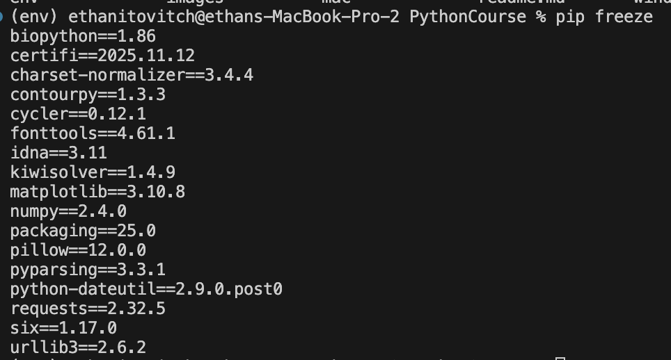

# Chapter 4 - Environments & Libraries

## Objective
By the end of this chapter you will know how to setup a python virtual environment for managing and sharing libraries

## Introduction
As you saw in the exercises in the last chapter, coding is about taking a high level task and breaking it down into steps. Sometimes you come across a step that is so common that someone went ahead and solved it for everyone as a public library. This is such an important part of coding that people will often talk about developer community when choosing between programming languages. While programming, you should start to build a habit of constantly asking yourself "Has someone had to solve this problem before?" If the answer is yes then there's likely a library available. You will get better and better at this instinct as you start playing around with libraries, so let's get started with it. But wait... one more talk about versions. I swear it's the last one!

## Virtual Environments
The first question you might be wondering is what is a library? and where does it live? The answer to the first question is: A library is nothing more than a piece of code. The second part is a little more complicated. 

Libraries are pushed to the cloud and with the help of git, tracked at different versions. Here's where it gets a little more complicated. When you pull in a library, it would be redundant to add the library code to your git history because it's already being tracked by its own git history. 

Really what we want is a way to track which version of the library you are using for a given project and a way to pull the correct version so that it sits next to your code and can be used. 

Now, back to the problem we saw with python versions, we need a way to easily switch between library versions such that you could use version `1.0.0` of some library for one project and `2.0.0` of the same library for a different project. I just checked the project I'm currently working on and it has over 40 libraries, so it would be a bit of a pain to have to use a command line tool like pyenv to manage the currently selected version of each library every time we switch between projects.

Really what we'd want is an environment per project that manages all the libraries which we can easily activate and deactivate when switching between projects. And that is exactly what virtual environments are for. 

If the above was a little too complicated (I know it was for me when I first started learning about this stuff) I hope going through what this looks like in practice might clear some things up. 

Okay so let's set up our first virtual environment. First, in the terminal, cd into the root of this project (into `C:\Users\YourUsername\Desktop\Projects\PythonCourse` - replace `YourUsername` with your actual Windows username, and you can confirm you're at the right spot by running `cd` in Command Prompt or `pwd` in PowerShell). Then create a virtual environment named `env` with `python -m venv env`. Now let's activate the virtual environment. If you're using PowerShell, run `env\Scripts\Activate.ps1`. If you're using Command Prompt, run `env\Scripts\activate.bat`. Done! You can confirm the virtual environment is activated by noticing the (env) in your terminal. You can deactivate the environment by entering `deactivate` into your terminal. But keep the env activated for now.


Now we can install libraries to our environment with `pip`. But don't worry, we don't need to do anything fancy to get access to the `pip` tool since it comes with python. 

Let's start with a pretty common one, the `requests` library. This one helps you fetch data from other websites. Go ahead and install it into your env with `pip install requests`. 

To use the library, create a python file in chapter_4 called `main.py` and add the following snippet of code:

```
import requests

r = requests.get("https://pokeapi.co/api/v2/pokemon/pikachu")
data = r.json()

print(data)
```

Notice the `import requests`. Since the requests library is now in our env we can simply import it out of thin air (also known as our virtual environment)

If you run this in your terminal, you will see A LOT of data on pikachu printed to the console. The data is fetched from the open pokemon api! What's cool is we didn't need to reinvent requests. Pulling data from other websites is such a common task that a team solved it for everyone and we can just use it for free!

Remember that algorithm we wrote to translate DNA, well turns out there's a library for that too: `biopython`. Install it with `pip install biopython` and add the following snippet to your `main.py` file

```
from Bio.Seq import Seq

dna = Seq("ATGGCTGACCTGTTCAAGGACGCTATCGAGTTCGAGCTGACCAAGTGGGACCTG")
print(dna.translate())
```

What else can we do? Maybe we want to graph some data. There's a great library for that called `matplotlib`. Install it in your env with `pip install matplotlib`. Then add the following snippet of code to your `main.py` file

```
import matplotlib.pyplot as plt

plt.plot([1, 2, 3], [1, 4, 9])
plt.show(block=False)
```

If you run the file you will now see a graph gui open up.

Now remember, the libraries we installed aren't a part of our project in the sense that if we shared this project with a friend, they wouldn't have the library code. So the next question is, how do we tell our friends about the libraries we installed and at what version so that they can recreate our virtual environment on their machine? Well `pip` has a handy command for that called `freeze` which will output all our env's library names and their versions.

Before we do that cd back to the root of the project and run `pip freeze` you will see the following output in your terminal



Notice the libraries and their versions. Now you might be wondering why there are so many libraries when you only installed 3. Well that's because even your libraries use other libraries!

But back to sharing, so now that you've printed the dependencies to the console it's time to put them in a file so you can share it with friends. In the root create a file called `requirements.txt` and copy paste the requirements into the file. 

You might be thinking that copy pasting from your terminal to a file might be a bit tedious and you're right! There's an easier way to do it with the following command `pip freeze > requirements.txt`. This takes the output of `freeze` and redirects it (>) to `requirements.txt`

Okay but what will our friends do with this file. Well let's imagine we're a new person who just pulled the codebase. To start the simulation deactivate your virtual env with `deactivate`. Then to simulate their experience let's create a new virtual environment with `python -m venv new-env` (typically we call our envs "env" but since we already have an "env" env in this project I called it "new-env"). Go ahead and activate new-env. If you're using PowerShell, run `new-env\Scripts\Activate.ps1`. If you're using Command Prompt, run `new-env\Scripts\activate.bat`. Now install the dependencies from the requirements file with `pip install -r requirements.txt`

Amazing, we now have a way to recreate the same virtual environment on two separate machines! For a grand finale, feel free to rerun the `main.py` file in chapter_4.

## Summary
- You should now have a basic understanding of what a virtual environment is, how to create one and how to install libraries
- You should now feel comfortable pulling a friend's codebase and recreating their virtual env.

